### CREATED WITHOUT GENAI (grammerly used to fix some grammer)

# Big Data Platforms — Assignment 2

**Student:** Muhammad Sabeeh Waqas
**ID:** 103704559

---

## Overview of project

Have implemented full project locally (with only GCP bucket as cache)

The tech stack is: Apache Kafka for messaging, Cassandra as the core data store (mysimbdp-coredms), Python for all components, and Docker for deployment of all the containers. Google Cloud Storage is used optionally as a second cache backend for the silver pipeline.

###### Architecture:


---

## Part 1

### P1.1

The platform separates infrastructure into two categories: things that are shared across all tenants because it makes no sense to duplicate them, and things that are dedicated per tenant because mixing them would break isolation.

###### Shared:

- The Kafka broker: one broker serves all topics. Adding a new tenant just means creating a new topic, not a new broker. (broker is itself a docker container)
- The Cassandra cluster: one cluster, but separate keyspaces per tenant.
- The Docker image (mysimbdp-platform:latest):all workers and services run from the same image. ( haved created custom image)
- The streamingestmanager and streamingestmonitor: one instance of each, they handle all tenants.

###### Dedicated:

- Kafka Producer : both the tenants ahve there dedicated kafka based prodcuer that are fetrchifn data from the API ( for simiplty hte API soruce is the same) with there own schema
- Kafka topic : "tenantA.bronze.raw" and "tenantB.bronze.raw" are completely separate. A tenantA message can never end up in tenantB's stream.
- Cassandra keyspace : "tenantA_bronze" and "tenantB_bronze" are separate keyspaces with separate tables.

- Worker container : each tenant gets its own running container ("streamingestworker-tenantA", "streamingestworker-tenantB"). although the python code is a single file but separate functions inside the code. Resource limits are applied per container.

- Kafka consumer group : each worker has its own consumer group ID, so offset tracking is completely independent.

This pay per use model works here because tenants can be billed based on their dedicated resources (worker container CPU/memory, Cassandra keyspace storage, Kafka partition usage). Adding a new tenant means creating a new topic, a new keyspace, and starting a new worker container and the shared infrastructure of platform can be scaled to accommodate new tenant without any changes.

---

### P1.2

The "streamingestmanager" is a python FastAPI service running on port 8001 in a docker container. It starts and stops worker containers on demand using the Docker SDK, it connects to the Docker socket and executed the "docker run" or "docker stop" commands.

###### The blackbox contract the tenant must follow:

The manager treats each worker as a blackbox. It doesn't care how the worker works internally. It only requires that the worker:

1. Accepts a standard set of command-line arguments: "--tenant", "--kafka", "--cassandra", "--monitor-url", "--report-window-sec"
2. Runs as a continuous running python code (not a one time script)
3. Connects to the assigned Kafka topic and Cassandra keyspace on its own
4. Reports KPI windows to the monitor url via HTTP POST every few seconds (can cahnge the no of seconds gap)
5. Shuts down propely when the container receives a stop signal as API call.
6. Starts properly when the container receiver a start signal from manager as API call.

###### From the tenant's side, to make their worker work they need to:

- Accept above mentioned CLI arguments (or equivalent env variables)
- Write to the Cassandra table schema the platform provides ("{tenant}\_bronze.records" with columns: pk, ingest_ts, event_ts, event_id, topic, payload)
- Send the report Json in the format the monitor expects (tenant_id, worker_id, ts, avg_ingest_ms, records, bytes, errors)

All the internal logics like how they parse messages, what transformations they apply is entirely the tenant's job. The manager just starts and stops the container.

###### API endpoints:

- "POST /tenants/{tenant_id}/workers/start" : creates and starts the worker container
- "POST /tenants/{tenant_id}/workers/stop" : stops it
- "GET /tenants/{tenant_id}/workers" : shows current status
- "GET /monitor/alerts" : shows alerts received from the monitor
- "POST /monitor/alerts" : receives alerts from the monitor (internal)

---

### P1.3

Two workers were tested, one for tenantA (flat schema) and one for tenantB (nested schema). Both produce messages to Kafka at a rate of approx. 10 messages per sec (can change by POLL_INTERVAL_SEC = 0.1s in the producers code file).

###### Normal load result:

docker logs of worker

TenantA
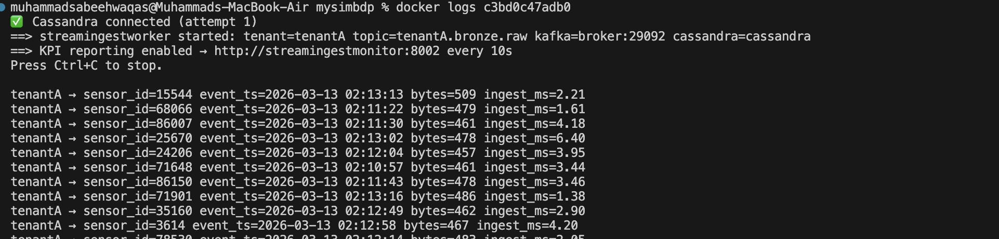

TenantB
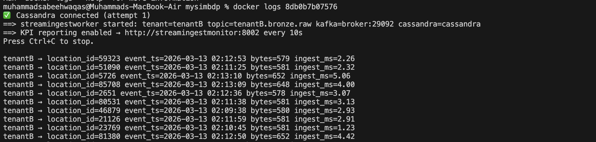

we can see the records inserted in bronze:
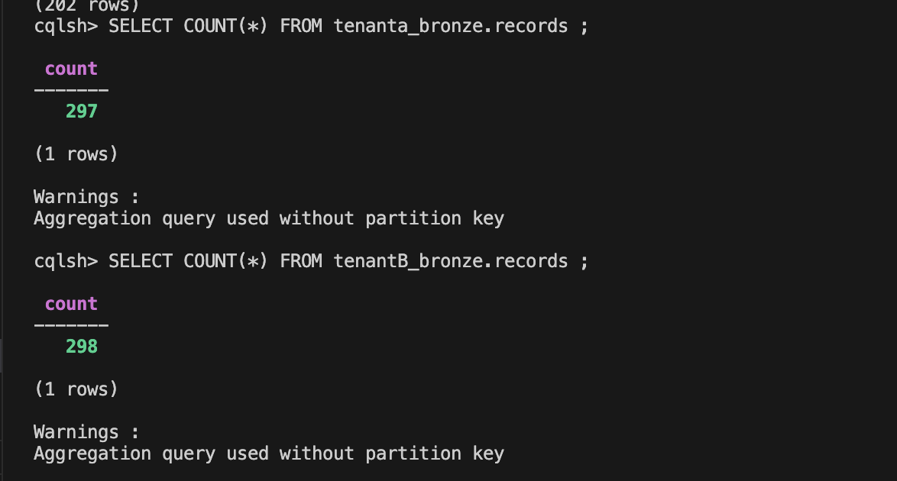

Under normal conditions both workers maintained average ingest latency well below the 50ms threshold (here its even below 5ms). Cassandra inserts were fast because the schema is simple (single partition key, one clusterings column).

###### Heavy/under-provisioned load:

To test under-provisioning, the tenantB worker was restricted using Docker resource limits in streamingestmanager.py:

"""python
mem_limit="128m"
cpu_quota=20000 # 20% of one CPU
"""
Then 10,000 messages were pushed into tenantB.bronze.raw using a pytohn flood script to simulate heavy load. As seen in the attached Docker logs, ingest_ms climbed above 50ms under this situation.

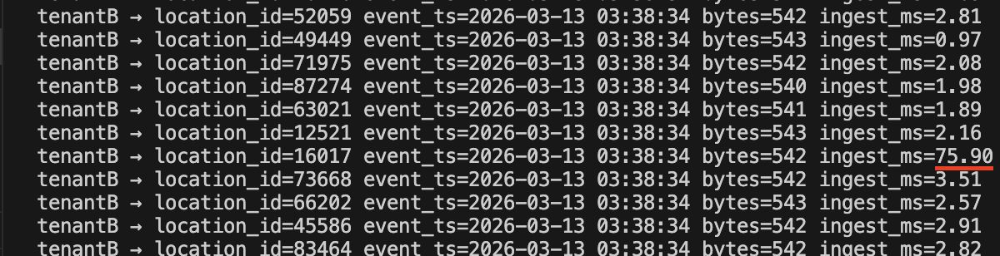

---

### P1.4

Each worker maintains a sliding window of metrics. Every "REPORT_WINDOW_SEC" seconds (default 10s) it computes the window stats and sends a JSON report to the monitor via HTTP POST to "/report".

**Report format:**

```json
{
  "tenant_id": "tenantA",
  "worker_id": "tenantA-streamingestworker",
  "ts": "2026-03-10T23:00:10.123456+00:00",
  "window_sec": 10,
  "avg_ingest_ms": 23.4,
  "records": 87,
  "bytes": 142680,
  "errors": 0
}
```

The fields cover exactly what the assignment asks for: average ingestion time ("avg_ingest_ms"), total data size ("bytes"), and number of records ("records"). Errors captures both parse failures and Cassandra write failures in the window.

###### Flow:

worker (every 10s) → POST /report → streamingestmonitor → persist to platform_logs.streaming_metrics → check avg_ingest_ms > threshold? → yes: POST /monitor/alerts → streamingestmanager

Tenant can access this table to observe the performance.

TenantA Streamingestworker performance


TenantB Streamingestworker performance
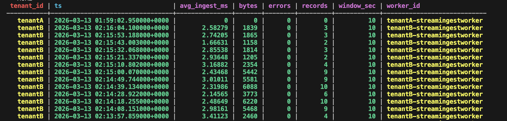

---

### P1.5

The monitor ("streamingestmonitor.py") runs on port 8002. When it receives a worker report, it:

1. stores the report to "platform_logs.streaming_metrics" in Cassandra (format shared in P1.4)
2. Checks if "avg_ingest_ms > MAX_AVG_INGEST_MS" (default 50ms) AND "records >= MIN_RECORDS_PER_WINDOW" (to ignore idle windows)
3. If both conditions are true, builds an alert and POSTs it to the manager at "/monitor/alerts"

The alert includes the tenant, worker ID, measured value, threshold, and a "suggested_action" field (set to "restart"). The manager receives this at "POST /monitor/alerts", stores it in the state file.

###### To force a threshold breach for testing, the threshold was lowered to 3ms in docker-compose.yaml:

In docker-sompose.yaml :
MAX_AVG_INGEST_MS: "3"

http://localhost:8001/monitor/alerts:


---

## Part 2

### P2.1

The platform enforces constraints before running any silver pipeline. These are defined in yaml files, one per tenant, in the "tenant_configs/" directory. The batchmanager reads these when starting and checks them before every run.

###### Why constraints are necessary from a platform provider perspective:

Without constraints, a misbehaving or misconfigured pipeline could fill the disk with cache files, run forever consuming CPU, try to write to a table that doesn't exist, or process garbage data that would corrupt the silver layer. The platform provider is responsible for the stability of shared infrastructure, constraints are the enforcement mechanism that keeps one tenant's pipeline from affecting others.

**TenantA constraints (tenantA.yaml):**

```yaml
tenant_id: "tenantA"
pipeline_script: "silverpipeline_tenantA.py"

scheduling:
interval_minutes: 5
max_runtime_seconds: 120

data_limits:
max_records_per_run: 5000
max_file_size_mb: 50
max_cache_files_pending: 20

constraints:
require_non_empty_bronze: true
reject_if_pending_overflow: true
reject_if_silver_table_missing: true
```

TenantA has a higher record limit because its data is flat and light. The 20 file pending limit gives some good buffer for runs that get backed up without making the disk fill completely.

**TenantB constraints (tenantB.yaml):**

```yaml
tenant_id: "tenantB"
pipeline_script: "silverpipeline_tenantB.py"

scheduling:
interval_minutes: 5
max_runtime_seconds: 180

data_limits:
max_records_per_run: 3000
max_file_size_mb: 75
max_cache_files_pending: 15

constraints:
require_non_empty_bronze: true
reject_if_pending_overflow: true
reject_if_silver_table_missing: true
require_geo_fields: true
```

TenantB gets a lower record limit (3000 vs 5000) because each record is larger due to the nested structure and same wall time, more bytes. The extra "require_geo_fields" constraint is tenantB-specific: their silver schema requires lat/lon, so running the pipeline without geo data would load zero useful records and waste time.

---

### P2.2

Each tenant provides their own silverpipeline python script. From the tenant's perspective, the pipeline has two different stages:

###### Stage 1 : Extract:

The pipeline connects to Cassandra, reads bronze records newer than the last watermark (stored in "platform_logs.silver_watermarks"), and writes them as JSON Lines to a local ".jsonl" file in pending cache directory. If GCS is configured (need to be configured manually, have create a guide for it as GCP-Setup-Guide.md), the file is also uploaded there.

The watermark is a simple CDC mechanism i.e. by remembering the maximum "ingest_ts" of the last batch, the pipeline only processes new records on each run. This avoids reprocessing and duplicate silver records.

###### Stage 2 : Transform and Load:

The pipeline reads the ".jsonl" file, applies the transformations to each record, and inserts the results into the silver Cassandra table. The file is then moved from "pending/" to "processed/".

TenantA transformations: cast numeric fields (pm10, pm2.5, lat, lon, alt), derive "aqi_bucket" from pm2.5 concentration using EPA breakpoints.

TenantB transformations: flatten nested geo/device/measurements sub-objects, cast coordinates, derive "has_pm_data" boolean flag.

Both pipelines print every stage update as a JSON line to stdout. The final line always has "stage=complete" and carries all metrics the batchmanager needs to persist.

---

### P2.3 — batchmanager design

The "batchmanager" is another python FastAPI service on port 8003. At startup it:

1. Connects to Cassandra (keeps retrying until cassandra is up)
2. Reads all "\*.yaml" files from "tenant_configs/"
3. Registers one APScheduler job per tenant, firing every "interval_minutes" (interval can be changed as per need, current default: 5 min)
4. Starts the scheduler

When a job fires (or a manual "/run" is triggered), batchmanager:

1. Checks all constraints for that tenant and if any fail, logs "constraint_violation" and returns
2. Builds the subprocess by command: "python silverpipeline_tenantA.py --run-id ... --max-records ... --cassandra --pending-dir ... --processed-dir ..."
3. Launches the subprocess and waits for it (up to "max_runtime_seconds")
4. Reads stdout line by line, finds the "stage=complete" JSON line, extracts metrics
5. Stores the full run record logs to "platform_logs.silver_pipeline_logs"

The pipeline is a true blackbox as batchmanager only knows its filename (from the yaml) and its output contract (exit code and complete JSON line). It doesnot know or care what happens inside.

###### How batchmanager knows which pipelines to run:

entirely through the yaml files. Each yaml declares "pipeline_script" and the scheduling config. Adding a new tenant is just adding a new yaml file and restarting batchmanager. No code changes needed.

---

### P2.4

###### Normal pipeline run:

http://localhost:8003/tenants/tenantA/logs showing a successful run with records_loaded, elapsed_sec, extract_sec, transform_sec, cache_mode


cqlsh showing SELECT from tenantA_silver.air_quality LIMIT 10 with actual data:

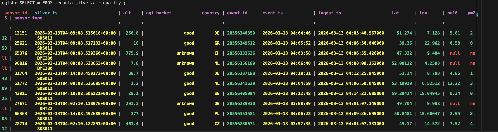

Similar can be seen for TenantB

###### Performance TenantA and TenantB:

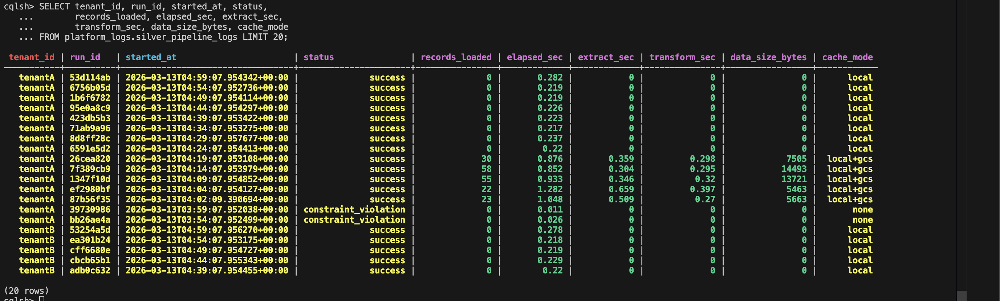
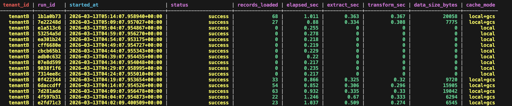

###### Constraint violation examples TenantA:

Can be done same for TenantB

SLA file for tenantA:
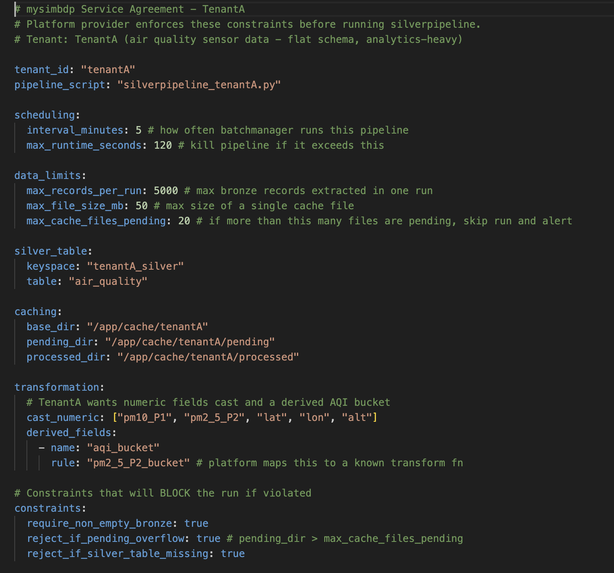

_Test 1 — silver table missing:_

The silver table was dropped with "DROP TABLE tenantA_silver.air_quality". The pipeline was triggered immediately. The run was blocked before any subprocess was launched.

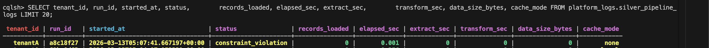

**Local disk vs GCS performance:**

Two runs are compared, one with "GCS_BUCKET" unset (local only) and one with it set to the GCS bucket.


Same no of records moved

The extract time is higher (almost double) in GCS mode because Stage 1 includes the GCS upload in addition to the Cassandra read and local file write. Transform time is comparable in both modes because Stage 2 always reads from the local file regardless of GCS.

###### Reason:

as GCP cache bucket is a geographically far as compared to the local cache , hence this brings some delay while writing to cloud cache.

---

### P2.5 — Logging and statistics

Every silver pipeline run is logged to "platform_logs.silver_pipeline_logs" in Cassandra.(SS shared above) The table has one row per run, with columns covering: run_id, tenant_id, started_at, finished_at, status, records_loaded, errors, elapsed_sec, extract_sec, transform_sec, data_size_bytes, cache_mode, pipeline_script, detail (last 4000 chars of stdout).

This gives the platform operator full visibility.

The "/stats" endpoint gives a summary as and API as well.
Note:Because Cassandra GROUP BY only works on partition keys, all aggregation is done in python using defaultdict, the batchmanager fetch up to 500 rows per tenant and computes averages and totals in the memory.

###### Example stats from the test runs:

http://localhost:8003/stats showing the full JSON response with per_tenant and platform sections

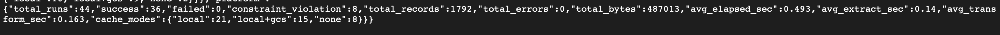

TenantB ran 44 times, 36 successful, 8 constraint_violation, total records moved to silver : 1792. etc...

###### How the platform could use this data:

- Billing : "data_size_bytes" and "records_loaded" per tenant per day gives the raw numbers which can be used to billing the tenant.
- SLA monitoring : if "elapsed_sec" consistently exceeds "max_runtime_seconds" for a tenant, their service agreement needs to be discussed.
- Debugging : the "detail" column stores the full pipeline stdout, so when a run fails you can see the exact error without needing to SSH anywhere

###### Statistics and logs:

Shows the Tenant's Silver pipleine statistics and logs, we can see no of recards loaded per run, , the start and end time of run, the status of run i.e. success or any constraint issue, time taken, the time taken to extract from bronze and time taken to perform transformation , size of data in bytes and finally the cache mode

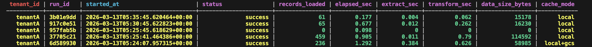
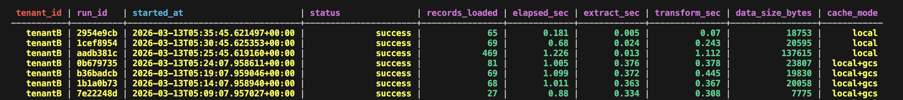

---

## Part 3

### P3.1

The diagram below shows how logging and monitoring flows across both Part 1 (streaming) and Part 2 (silver transformation)

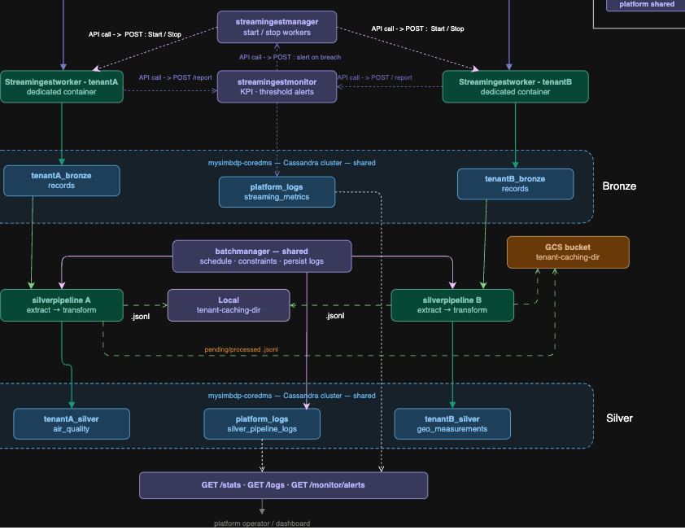

###### Workflow of performance:

Producer to cassandra

- workers sending reports to streamingestmonitor → streaming_metrics table
- Monitor checking threshold -> alert to manager
- Monitor stores performance data into plarform_logs

Bronze to silver

- batchmanager launching silverpipeline -> reading stdout -> pushes logs into silver_pipeline_logs table

The key point is that both monitoring paths store data into the same Cassandra keyspace ("platform_logs" keyspace) but different tables. The platform operator queries both tables to get a complete picture.

For per-tenant visibility, since "tenant_id" is the partition key in both tables, a simple query like "SELECT \* FROM platform_logs.streaming_metrics WHERE tenant_id = 'tenantA'" gives all of that tenant's streaming KPIs. The same works for silver logs. The "/stats" endpoint already does this aggregation and could be connected to a dashboard like Grafana or even a simple cron job that emails a daily summary per tenant.

---

### P3.2

Currently the worker writes parsed messages to one sink i.e. the bronze Cassandra table. If a tenant needed to also write to a second sink (for example a different database), one good way is

To publish message again to a second Kafka topic after writing to Cassandra. For example, after the successful bronze insert, the worker also calls "producer.produce("tenantA.bronze.extrasink", ...)". A completely separate consumer reads from that topic and writes to the extra sink at its own pace.

This makes the main ingestion path fast and gives second sink full independence it can be slow, without affecting bronze ingestion at all. The existing Kafka infrastructure can supports this with no additional broker setup needed.

---

### P3.3

Right now the worker ingests everything that comes through Kafka regardless of data quality, it is a raw bronze store. To add quality filtering, the following changes can be made without breaking the existing design.

A quality check function would be added to the worker, called after parsing but before the Cassandra insert. It would then validate things like: lat/lon within the ranges (-90 to 90, -180 to 180), pm10 and pm2.5 not negative, sensor_id not null. The quality rules can be defined in a config per tenant this can easily fit into the existing yaml SLA pattern.

A new Cassandra table "platform_logs.data_quality_log" can we created to store one row per message checked, with columns like : tenant_id, sensor_id, ingest_ts, passed (TRUE/FALSE), and issues (text describing what failed). Messages that fail the check are not inserted into bronze but are logged here.

The worker would write to both tables, bronze for passing records, quality_log for all records. This gives full auditing ability and can help see exactly what was rejected and why, and query the rejection rate per tenant over time.

---

### P3.4

The current design is one yaml file per tenant and one pipeline per tenant. To support a tenant with multiple pipelines (for example one for basic cleaning, one for ML tasks), the yaml structure would be extended to list multiple pipelines:

```yaml
tenant_id: "tenantA"
pipelines:
  - pipeline_id: "basic_cleaning"
    pipeline_script: "silverpipeline_tenantA_basic.py"
    scheduling:
    interval_minutes: 5
    data_limits:
    max_records_per_run: 5000
  - pipeline_id: "feature_engineering"
    pipeline_script: "silverpipeline_tenantA_features.py"
    scheduling:
    interval_minutes: 60
    data_limits:
    max_records_per_run: 1000
```

The batchmanager's "load_tenant_configs()" function would be updated to iterate over the pipelines list and register one APScheduler job per pipeline entry rather than one per tenant. The "run_pipeline()" function itself barely changes because it is already accepting any script name and any config dict.

Each pipeline entry can also specify its own resource limits (CPU, memory) so the heavy pipeline gets more resources than the light and basic ones.

---

### P3.5

The current silverpipeline already has two internal stages, Stage 1 (extract bronze -> cache file) and Stage 2 (transform cache file -> silver Cassandra). They run one after other inside one process. If the pipeline becomes complex enough that this causes problems, the best way is to split them into two completely separate scripts.

###### silverpipeline_extract.py

only does Stage 1 i.e. Reads bronze, writes ".jsonl" to pending dir, ends.

###### silverpipeline_transform.py

only does Stage 2 i.e. Reads ".jsonl" files from pending dir, transforms, loads to silver, moves files to processed dir, ends

The batchmanager would then run to extract, then if it fine then run transform. They communicate through the cache filesystem.

The reasons this is better:

- Fault tolerance
  If transform crashes halfway through, the ".jsonl" file is still in pending. The batchmanager can retry transform again without going back to Cassandra bronze. Right now a Stage 2 crash requires rerunning the full pipeline, which can corrupte data.

- Easier to maintain
  A tenant can change their transformation logic (add a new derived field, change a formula) by only updating "silverpipeline_transform.py". The extract script stays untouched. Each script is half the size and much easier to test and debug in isolation.

- Parallelism
  if multiple ".jsonl" files accumulate in pending, multiple transform workers could process different files in parallel. This is not possible when extract and transform are in one script.

---

## Appendix

### API endpoints

| Endpoint                                              | Description             |
| ----------------------------------------------------- | ----------------------- |
| GET http://localhost:8001/health                      | Manager health          |
| POST http://localhost:8001/tenants/{id}/workers/start | Start worker            |
| POST http://localhost:8001/tenants/{id}/workers/stop  | Stop worker             |
| GET http://localhost:8001/monitor/alerts              | View alerts             |
| GET http://localhost:8002/health                      | Monitor health          |
| GET http://localhost:8003/health                      | Batchmanager health     |
| POST http://localhost:8003/tenants/{id}/run           | Trigger silver pipeline |
| GET http://localhost:8003/tenants/{id}/logs           | Pipeline run history    |
| GET http://localhost:8003/stats                       | Platform-wide stats     |

### Cassandra tables

| Table                              | Purpose                                    |
| ---------------------------------- | ------------------------------------------ |
| tenantA_bronze.records             | Raw bronze data for tenantA                |
| tenantB_bronze.records             | Raw bronze data for tenantB                |
| tenantA_silver.air_quality         | Cleaned silver data for tenantA            |
| tenantB_silver.geo_measurements    | Cleaned silver data for tenantB            |
| platform_logs.streaming_metrics    | Worker KPI reports (per window)            |
| platform_logs.silver_pipeline_logs | Silver pipeline run history                |
| platform_logs.silver_watermarks    | Last processed bronze timestamp per tenant |

### Dataset

Source: sensor.community open air quality API
URL: https://data.sensor.community/static/v2/data.json
